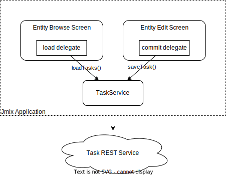
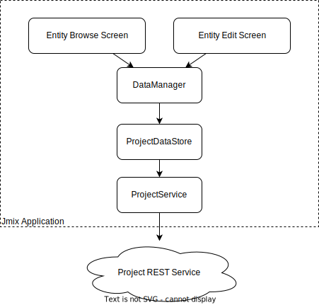

# External Data Sample

The project demonstrates how to display and manage data received from an external data source using standard Jmix CRUD screens.

External data for this example is supposed to be provided by a REST service with the following endpoints:

* `GET /tasks` returns a list of tasks
* `POST /tasks` creates a new task
* `POST /tasks/{id}` updates a task with a given id
* `GET /projects` returns a list of projects
* `POST /projects` creates a new project
* `POST /projects/{id}` updates a project with a given id

The `jmix-samples` repository contains an implementation of such a service in the `external-data-service` directory. See its [README](../external-data-service/README.md) for how to start the service. By default, it runs on port 18080, so the `/tasks` URL will be `http://localhost:18080/tasks`.

## Using Load and Commit Delegates

The first approach to working with external data in UI is to delegate loading and saving entities to a custom service instead of `DataManager` which is used by default.

The project contains the [Task](src/main/java/com/company/externaldata/entity/Task.java) DTO entity and its browser and editor screens. [TaskService](src/main/java/com/company/externaldata/app/TaskService.java) makes HTTP requests to external API and maps data to and from DTOs.

The list of DTO entities is loaded to the [TaskBrowse](src/main/java/com/company/externaldata/screen/task/TaskBrowse.java) screen from `TaskService` using the [data loader delegate](https://docs.jmix.io/jmix/ui/data/data-loaders.html#load-delegate).

Saving of the DTO entity through `TaskService` is implemented using the [commit delegate](https://docs.jmix.io/jmix/ui/data/data-context.html#commit-delegate) in [TaskEdit](src/main/java/com/company/externaldata/screen/task/TaskEdit.java) screen.



## Using Custom Data Store

Another approach for working with external data is to create a [custom data store](https://docs.jmix.io/jmix/data-model/data-stores.html#custom) for working with DTO entity. In this case, each time you load or save the DTO entity associated with the custom data store using the `DataManager`, the entity will be read/saved by REST services instead of the database.


[ProjectDataStore](src/main/java/com/company/externaldata/datastore/ProjectDataStore.java) is the custom datastore that saves and loads projects using the REST service. [ProjectDataStoreDescriptor](src/main/java/com/company/externaldata/datastore/ProjectDataStoreDescriptor.java) is the data store descriptor needed for registering the data store in the application. The custom data store and its descriptor are also registered in [application.properties](src/main/resources/application.properties).

The [Project](src/main/java/com/company/sample/entity/Project.java) DTO entity is associated with this `projectds` data store:

```java
@Store(name = "projectds")
@JmixEntity
public class Project {
    //...
}
```

Now you don't have to intercept loading/saving data in screens and redirect to a custom service, because `DataManager` will dispatch all requests for the `Project` entity to its data store. Each time you work with `Project` using the `DataManager` the actual job will be done by `ProjectDataStore`. 



## Conclusion

We recommend creating a custom data store for an external data service if the service provides a rich API for working with data: CRUD, paging, sorting, filtering, maybe even a query language. By implementing a data store for such a service you will make it more "native" for development with Jmix. You can inherit your data store from the `AbstractDataStore` class (which is used also for built-in `JpaDataStore`) and therefore employ the framework mechanisms like security and audit for external data.

If the external service provides just a few simple operations, it's better to use load/commit delegates to bypass `DataManager` in UI screens and instead redirect to the service.