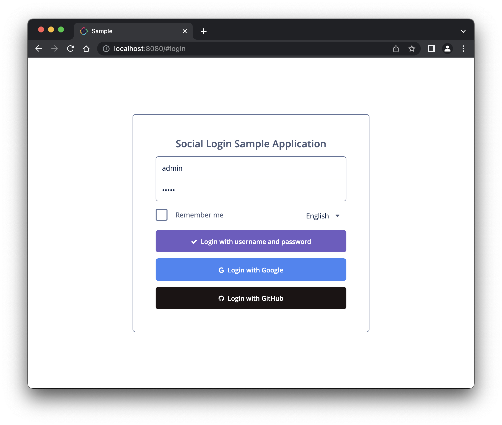

# Jmix Social Login Sample

## Overview

The application demonstrates how to authenticate in a Jmix application with different OAuth2 providers.  Current example allows users to login using Google or GitHub account.



This example doesn't use the [OIDC add-on](https://www.jmix.io/marketplace/openid-connect/). However, in most cases integration with OIDC providers can be implemented with this add-on.

When the user is authenticated using an external provider the application checks whether the user entity instance linked with given Google or GitHub account already exists in Jmix database. If the user exists, it is loaded from the database and is set into security context. If not, then a new user is created in the Jmix database and is linked with Google or GitHub account. 

## Prerequisites

Set up Google authentication:

- Create a new Client ID for Web application at https://console.cloud.google.com. Use `http://localhost:8080/login/oauth2/code/google` as Authorized redirect URI. 
- Copy Client ID and Client secret from the Google console and set them in `spring.security.oauth2.client.registration.google.client-id` and `spring.security.oauth2.client.registration.google.client-secret` application properties.

Set up GitHub authentication:

- Create a new OAuth App at https://github.com/settings/developers. Use `http://localhost:8080/login/oauth2/code/github` as Authorization callback URL.
- Generate a new client secret. Copy Client ID and client secret and set them in `spring.security.oauth2.client.registration.github.client-id` and `spring.security.oauth2.client.registration.github.client-secret` application properties.

## Implementation details

The [build.gradle](build.gradle) file contains dependencies to Spring Security OAuth2 Client and JOSE libraries:

```gradle
dependencies {
    // ...
    implementation 'org.springframework.security:spring-security-oauth2-client'
    implementation 'org.springframework.security:spring-security-oauth2-jose'
```

[OAuthSecurityConfig](src/main/java/com/company/sociallogin/OAuthSecurityConfig.java) is the Spring security configuration class. It configures authentication support using an OAuth 2.0 and OpenID Connect 1.0 Provider. Google uses OpenID Connect protocol and GitHub uses OAuth 2.0. 

The [User](src/main/java/com/company/sociallogin/entity/User.java) entity additionally implements the `org.springframework.security.oauth2.core.oidc.user.OidcUser` interface.

[LoginScreen](src/main/java/com/company/sociallogin/screen/login/LoginScreen.java) controller redirects to authorization URLs if the user chooses to log in with Google or GitHub.

The [application.properties](src/main/resources/application.properties) file contains your Google and GitHub OAuth applications client id and secret.